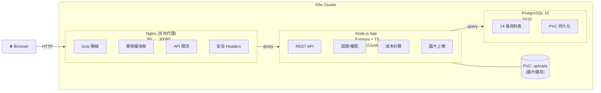
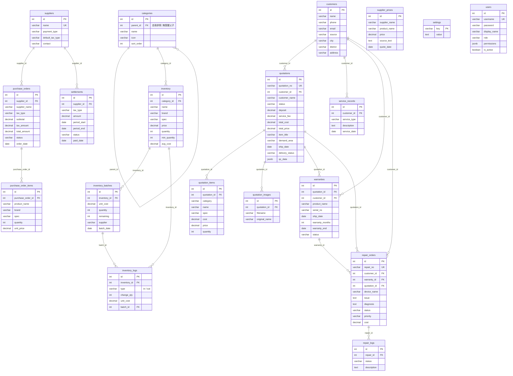

# 星辰電腦 NSZPC 管理系統

內網使用的星辰電腦管理系統，涵蓋庫存管理、訂單管理、盤商報價提取、客戶關係管理、社群追蹤等功能。

## 系統架構



## 技術架構

| 層級 | 技術 |
|------|------|
| 語言 | TypeScript |
| 後端 | Node.js + Express |
| 資料庫 | PostgreSQL 16 |
| 前端 | HTML/CSS/JS + Bootstrap 5 |
| 圖表 | Chart.js |
| OCR | Tesseract.js (前端) |
| 套件管理 | pnpm |
| 容器化 | Docker |
| 編排 | Kubernetes (microk8s) |
| 反向代理 | Nginx |
| CI/CD | GitHub Actions |

## ER Model



### 資料表關聯說明

| 模組 | 資料表 | 說明 |
|------|--------|------|
| **庫存** | `categories` | 自我參照的無限層分類樹 (parent_id → id) |
| | `inventory` | 商品主表，歸屬於分類 |
| | `inventory_batches` | 進貨批次，支援 FIFO / 加權平均成本計算 |
| | `inventory_logs` | 進出貨異動紀錄 |
| **訂單** | `quotations` | 估價單/訂單主表，關聯客戶 |
| | `quotation_items` | 訂單零件明細 |
| | `quotation_images` | 訂單附件圖片 |
| **客戶** | `customers` | 客戶資料，含來源/地區追蹤 |
| | `service_records` | 客戶服務紀錄 (組裝/維修/升級) |
| **進貨** | `suppliers` | 盤商設定 (結款方式/稅別) |
| | `purchase_orders` / `_items` | 叫貨訂單與明細 |
| | `settlements` | 對帳結款紀錄 |
| | `supplier_prices` | 歷史報價 (Line/OCR 解析) |
| **售後** | `warranties` | 保固管理，關聯訂單+客戶 |
| | `repair_orders` | 維修工單 |
| | `repair_logs` | 維修進度紀錄 |
| **系統** | `users` | 使用者帳號與頁面級權限 |
| | `settings` | 系統設定 (key-value) |

## 功能特色

### 1. 庫存管理
- **左側分類樹 + 右側表格**雙欄佈局
- **任意深度分類**：例如 CPU > AMD > AM5（三層），顯示卡 > 華碩（兩層）
- **進貨/出貨管理**：批次進貨記錄、FIFO 或加權平均成本計算
- **批次明細**：每件商品可查看進貨批次、異動紀錄、FIFO 成本 vs 均價
- 成本/售價/利潤計算、低庫存警示
- 圖表視覺化（數量分佈、成本 vs 售價）

### 2. 訂單管理
- 訂單建立與管理，支援多個同分類項目
- **客戶搜尋下拉選單**：自動關聯客戶，帶入地區資訊
- **服務費**獨立欄位、自動計算毛利與毛利率
- 訂單狀態：尚未成交 → 已付訂金 → 尚未結單 → 已完成
- 訂單類型：備料中 / 組裝中 / 測試中 / 待出貨 / 已出貨 / 已送達
- **雙重篩選**：狀態 + 類型可組合篩選
- **項目拖曳排序**：拖曳手把調整零件順序
- **圖片附件上傳**（每筆訂單可上傳多張圖片）
- **匯出訂單**：自訂有效天數、自動帶入客戶物流資訊
- **出機檢查單**：完整 QC 表格匯出（OS/BIOS、OCCT、R23、AIDA64+FURMARK 等）
- **成交自動建檔**：訂單成交時自動將客戶新增至客戶管理

### 3. 盤商報價提取
- **Line 訊息解析**：貼上報價訊息自動提取品名與價格
- **圖片 OCR**：上傳報價單截圖或 Ctrl+V 貼上，自動辨識（Tesseract.js）
- **盤商下拉選單**：自定義盤商清單 + 歷史紀錄自動合併
- **報價日期**：每筆報價記錄日期，按月份分組顯示
- 歷史報價紀錄查詢與篩選

### 4. 客戶關係管理
- 客戶來源追蹤：YouTube、Instagram、Line、門市、朋友介紹
- **台灣地區分佈地圖**視覺化
- 服務紀錄（組裝、維修、升級等）
- 來源分佈統計圖表
- 與訂單雙向關聯

### 5. 進貨與結款
- 盤商管理（結款方式：週結/月結/貨到付款）
- 叫貨訂單建立與到貨入庫
- 含稅/未稅自動計算
- 結款紀錄管理（待結/已結）

### 6. 售後服務
- **保固管理**：自動計算到期日，到期提醒
- **維修工單**：建單 → 診斷 → 維修 → 完成，完整流程追蹤
- 維修進度日誌

### 7. 社群追蹤
- **YouTube**：設定 API Key + 頻道 ID，即時查看訂閱數/觀看次數/影片數
- **Instagram**：自動爬蟲抓取追蹤人數（含手動輸入備案）
- **店家資訊**：地址/電話/LINE（用於出機檢查單）

### 8. 權限管理
- 使用者帳號管理（管理員/一般使用者）
- **頁面級權限控制**：管理員可設定每位使用者可存取的頁面
- 登入/登出

### 9. 儀表板
- 庫存品項/成本/利潤統計卡片
- YouTube 訂閱數 + Instagram 追蹤數即時顯示
- **當月訂單狀況**：狀態卡片 + 訂單類型 badge
- 庫存分類圖表
- 低庫存警示、保固到期、未結款、進行中維修通知

## 快速開始

### 前置需求

- Node.js 22+
- pnpm
- PostgreSQL 16+（或使用 Docker/K8s 部署）

### 本地開發

```bash
# 安裝依賴
pnpm install

# 啟動 PostgreSQL（需要先建立資料庫）
# createdb -U postgres nszpc

# 設定環境變數
export DB_HOST=localhost DB_PORT=5432 DB_NAME=nszpc DB_USER=nszpc DB_PASSWORD=nszpc

# 開發模式（nodemon 自動重啟）
pnpm dev

# 正式啟動
pnpm start
```

### Docker Compose 部署

```bash
docker compose up -d --build
```

### K8s 部署 (microk8s)

```bash
chmod +x deploy/setup-k8s.sh
./deploy/setup-k8s.sh
```

### 預設帳號

| 帳號 | 密碼 | 角色 |
|------|------|------|
| admin | admin | 管理員（全部權限） |

## 專案結構

```
├── src/
│   ├── server.ts              # 伺服器入口
│   ├── types/                 # TypeScript 型別定義
│   ├── models/
│   │   └── database.ts        # PostgreSQL Schema + 成本計算工具
│   └── routes/
│       ├── auth.ts            # 認證與使用者管理
│       ├── inventory.ts       # 庫存 + 分類 + 進出貨
│       ├── quotations.ts      # 訂單管理 + 圖片上傳
│       ├── customers.ts       # 客戶管理
│       ├── suppliers.ts       # 盤商報價 + OCR 解析
│       ├── purchases.ts       # 叫貨訂單 + 結款管理
│       ├── reports.ts         # 報表 + 保固 + 維修 + 匯出
│       └── settings.ts        # 設定 + IG 爬蟲
├── public/                    # 前端靜態檔案
│   ├── index.html
│   ├── css/style.css
│   └── js/
│       ├── api.js             # API 工具與認證
│       ├── app.js             # 主應用邏輯
│       └── pages/             # 各頁面模組
├── deploy/
│   ├── setup-k8s.sh           # 一鍵 K8s 部署腳本
│   ├── k8s/                   # K8s manifests
│   │   ├── namespace.yaml
│   │   ├── secret.yaml
│   │   ├── pv.yaml
│   │   ├── postgres.yaml
│   │   ├── deployment.yaml
│   │   ├── service.yaml
│   │   ├── nginx-config.yaml
│   │   └── nginx.yaml
│   └── *.env                  # 環境設定檔
├── Dockerfile
├── docker-compose.yml
├── tsconfig.json
└── package.json
```

## 注意事項

- 本系統設計為**內網使用**，不建議直接暴露到公網
- 認證使用 SHA-256 + 記憶體 Session，重啟伺服器後需重新登入
- PostgreSQL 資料透過 PersistentVolume 持久化
- 上傳的圖片儲存在 PVC `/app/data/uploads/`
- 資料庫備份請使用 `pg_dump`
